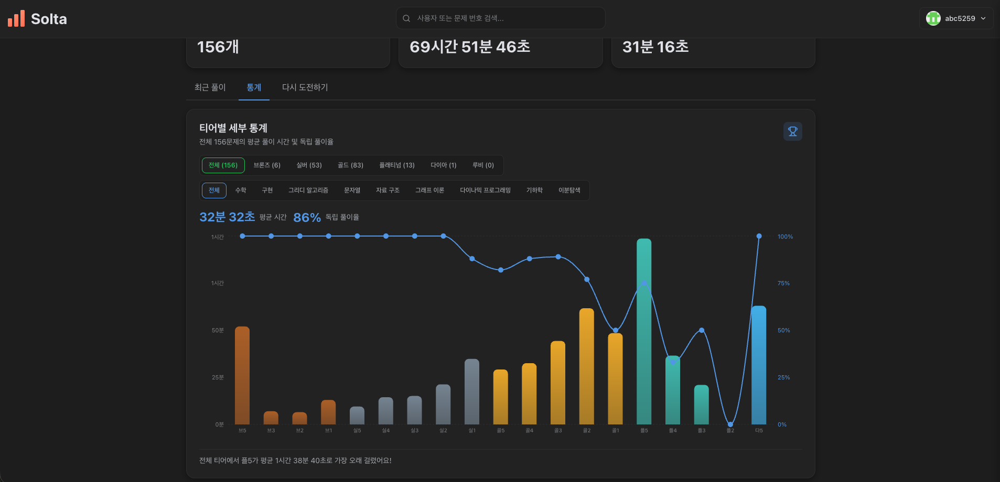
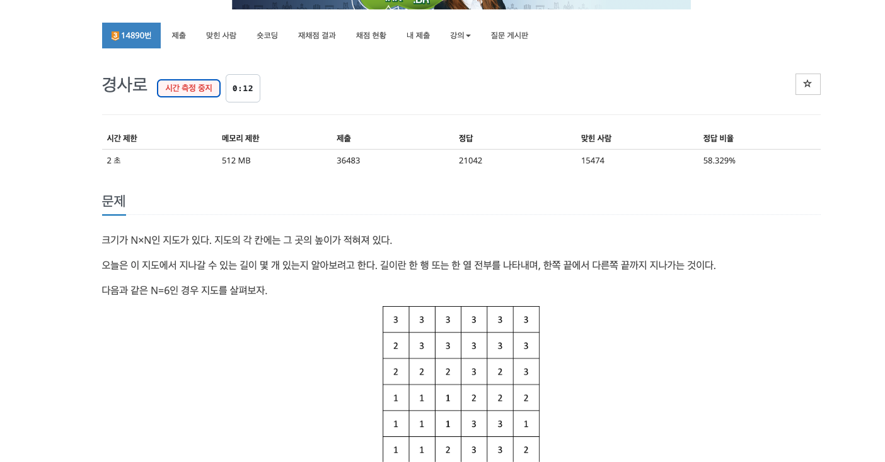
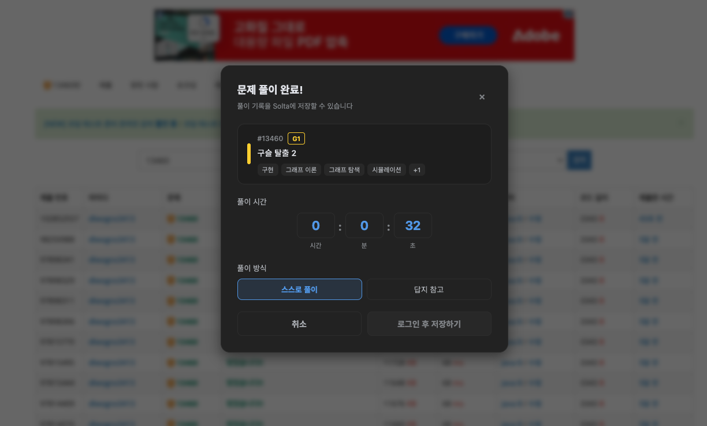

# Solta Chrome Extension

> 백준 문제 풀이 시간을 자동으로 측정하고 [Solta](https://solta.kr)에 기록하는 Chrome 확장 프로그램

---

## Solta가 뭔가요?

**[Solta](https://solta.kr)** 는 백준(BOJ) 문제 풀이 기록을 관리하는 서비스입니다.
문제를 얼마나 걸려 풀었는지, 어떤 방식으로 접근했는지를 체계적으로 기록하고 돌아볼 수 있어요.

이 확장 프로그램을 설치하면 **백준 페이지에서 바로** 타이머를 시작하고, 정답 판정 시 자동으로 Solta에 기록할 수 있습니다.

---

## 주요 기능

- **자동 타이머** — 백준 문제 페이지에 진입하면 타이머 버튼이 나타납니다. 시작 버튼을 누르는 순간부터 시간이 측정됩니다.
- **AC 자동 감지** — 채점 결과가 `맞았습니다!`가 되면 자동으로 저장 모달이 열립니다.
- **풀이 방식 선택** — `스스로 풀기` / `풀이 참고` 중 선택해 기록할 수 있습니다.
- **풀이 메모** — 핵심 아이디어나 놓친 점을 간단히 메모로 남길 수 있습니다.
- **solved.ac 티어 표시** — 문제 티어를 색상으로 확인할 수 있습니다.

---

## 설치 방법

[Chrome 웹 스토어에서 설치하기](https://chromewebstore.google.com/detail/boj-performance/bklabnmnfggmenngdnlndikconflcbij)

---

## 사용 방법

### 1. 로그인

확장 아이콘을 클릭해 팝업을 열고 **GitHub으로 로그인**합니다.
Solta 계정이 없다면 [solta.kr](https://solta.kr) 에서 먼저 가입해 주세요.

### 2. 타이머 시작

백준 문제 페이지에 접속하면 화면에 타이머 버튼이 나타납니다.
풀기 시작할 때 버튼을 눌러 타이머를 시작하세요.

### 3. 정답 후 기록

채점 결과에서 `맞았습니다!` 판정을 받으면 저장 모달이 자동으로 열립니다.
풀이 방식을 선택하고 저장하면 Solta에 기록됩니다.

---

## 관련 링크

- 웹사이트: [solta.kr](https://solta.kr)
- Chrome 웹 스토어: [설치 페이지](https://chromewebstore.google.com/detail/boj-performance/bklabnmnfggmenngdnlndikconflcbij)
- 문의 및 버그 리포트: [GitHub Issues](https://github.com/solta-kr/solta-extension/issues)
